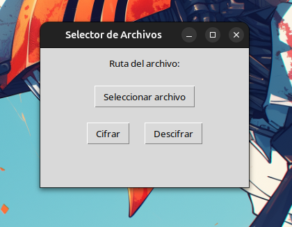
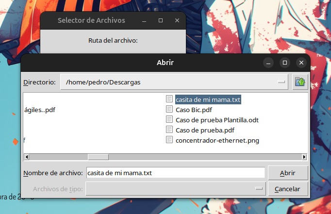
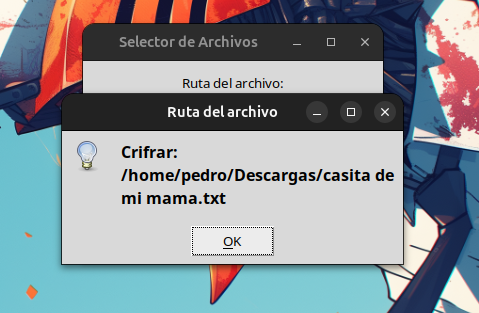
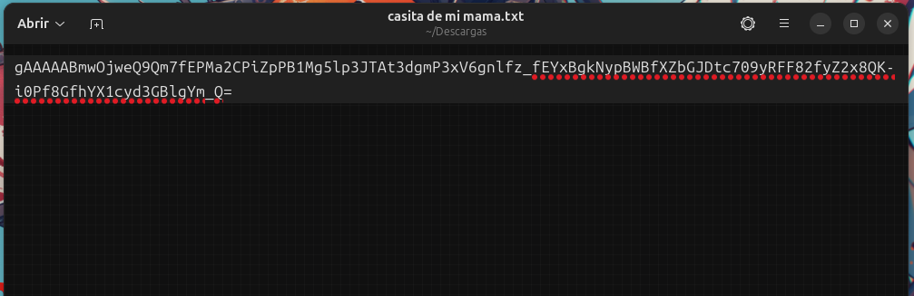
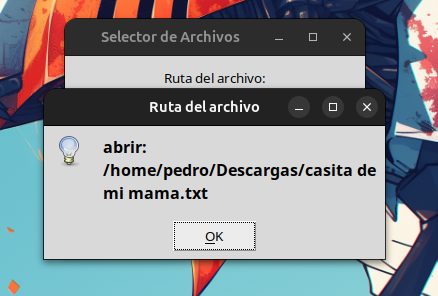
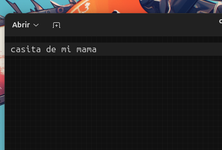

# Encriptar con Python
## P. J. Aguilar Vaides 
#### 7690-20-8927
Programa de escritorio con python para poder cifrar y desifrar un archivo.

### Librerias

- Cryptography
- tkinter

Primero necesitamos de crear los metodos para la parte del cifrado y desifrado de los archivos

### Codigo para el cifrado

#### Crear clave y cargar clave
```python
from cryptography.fernet import Fernet

def generarClave():
    clave = Fernet.generate_key()
    with open("clave.key", "wb") as archivo_clave:
        archivo_clave.write(clave)

def cargarClave():
    return open("clave.key", "rb").read()
```

#### Cifrar y desifrar un documento
```python
def encriptar(nom_archivo,clave):
    f = Fernet(clave)
    with open(nom_archivo, "rb") as file:
        archivo_info = file.read()
    encrypted_data = f.encrypt(archivo_info)
    with open(nom_archivo, "wb") as file:
        file.write(encrypted_data)

def desencriptar(nom_archivo,clave):
    f = Fernet(clave)
    with open(nom_archivo, "rb") as file:
        encrypted_data = file.read()
    decrypted_data = f.decrypt(encrypted_data)
    with open(nom_archivo, "wb") as file:
        file.write(decrypted_data)
```

### Codigo parte grafica
```python
import tkinter as tk

from tkinter import filedialog
from tkinter import messagebox

# Grafico
# Función que abre el diálogo para seleccionar un archivo
def seleccionar_archivo():
    ruta_archivo = filedialog.askopenfilename()
    if ruta_archivo:
        ruta_variable.set(ruta_archivo)

# Función que se ejecuta al presionar el botón 1
def ejecutar_funcion_1():
    if ruta_variable.get():
        messagebox.showinfo("Ruta del archivo", f"Crifrar: {ruta_variable.get()}")
        
        clave = cargarClave()
        
        nom_archivo = ruta_variable.get()
        encriptar(nom_archivo, clave)
    else:
        messagebox.showwarning("Advertencia", "Primero selecciona un archivo")

# Función que se ejecuta al presionar el botón 2
def ejecutar_funcion_2():
    if ruta_variable.get():
        messagebox.showinfo("Ruta del archivo", f"Desifrar: {ruta_variable.get()}")

        clave = cargarClave()
        
        nom_archivo = ruta_variable.get()
        desencriptar(nom_archivo, clave)
    else:
        messagebox.showwarning("Advertencia", "Primero selecciona un archivo")

# Crear la ventana principal
ventana = tk.Tk()
ventana.title("Selector de Archivos")
ventana.geometry("300x200")

# Crear una variable para almacenar la ruta del archivo seleccionado
ruta_variable = tk.StringVar()
generarClave()

# Etiqueta para mostrar la ruta del archivo seleccionado
label_ruta = tk.Label(ventana, text="Ruta del archivo:")
label_ruta.pack(pady=10)

# Botón para seleccionar archivo
boton_seleccionar = tk.Button(ventana, text="Seleccionar archivo", command=seleccionar_archivo)
boton_seleccionar.pack(pady=10)

# Crear un frame para colocar los botones en la misma línea
frame_botones = tk.Frame(ventana)
frame_botones.pack(pady=10)

# Botón para ejecutar función 1 (Cifrar)
boton_funcion_1 = tk.Button(frame_botones, text="Cifrar", command=ejecutar_funcion_1)
boton_funcion_1.pack(side="left", padx=10)

# Botón para ejecutar función 2 (Descifrar)
boton_funcion_2 = tk.Button(frame_botones, text="Descifrar", command=ejecutar_funcion_2)
boton_funcion_2.pack(side="left", padx=10)

# Ejecutar el bucle principal de la ventana
ventana.mainloop()
```

## Funcionamiento

Una vez terminado el codigo y ejecutado, la ventana se vera asi:


Seleccionas el archivo


Clic en Cifrar y ok


El archivo cifrado quedara asi:


Despues puedes desifrarlo con el boton Desifrar y ok


Y listo


Repostiorio: [Visita GitHub](https://github.com/PJBigBoss115/encriptar_Python.git)
